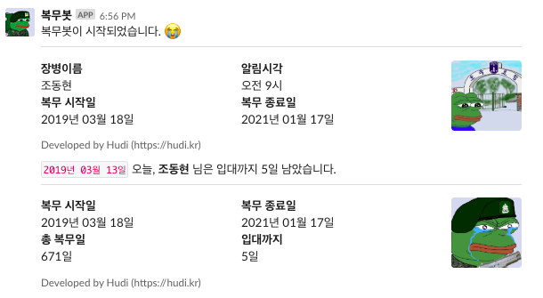

# 복무봇 (Bokmu-Bot)



복무봇은 제가 군대를 가고 나서도 Slack 을 통해 저와 제 지인들이 제 군복무율을 확인할 수 있도록 만든 프로젝트 입니다.

하루에 한번, **정해진 시간마다 복무일자와 복무율**을 알려줍니다. 만약 아직 입대하지 않았다면, **입대까지 남은 날**을 보여줍니다.

## Dependencies

아래 모듈을 설치 해야합니다.

- SlackClient
- dateutil
- schedule

## Get Started

### Create Your Slack App

Slack 에서 여러분의 **[App을 생성](https://api.slack.com/apps)** 해주세요.

### Add Bot User into Slack

Basic Information > Add features and functionality 에서 `Bots` 를 클릭합니다.

그 다음 `Add a Bot User` 를 클릭하고, Display Name 과 Default username 을 채워 넣고, `Add Bot User` 를 클릭해 여러분 Slack 에 봇 유저를 생성합니다.

### Fill config.json

App 과 Bot User를 생성하셨다면, `config.json` 파일을 `app.py` 와 같은 경로에 생성해줍니다. 그리고 `config.example.json` 파일의 내용을 복사하여 붙여 넣어줍니다. `config.example.json` 의 내용은 다음과 같습니다.

```json
{
  "slack": {
    "apiToken": "Slack App API Token (Bot User OAuth Access Token)",
    "clientId": "Slack App Client ID",
    "clientSecret": "Slack App Client Secret",
    "verificationToken": "Slack App Verification Token",
    "channelId": "Slack Channel Id"
  },
  "bot": {
    "yourName": "사용자 이름",
    "notifyAt": "슬랙에 매일 메세지를 보낼 시각. 24시간제 시간제로 기입 (오전 7시는 7, 오후 1시는 13)",
    "startDate": "yyyy/mm/dd (입대일자)",
    "endDate": "yyyy/mm/dd (제대일자)"
  }
}
```

### API 정보

그 다음 `config.json` 파일을 아래 설명을 읽고 채워 넣어주세요.

- **clientId, clientSecret, verificationToken**

  Basic Information > App Credentials

  에서 찾으실 수 있습니다. 해당하는 정보를 입력해줍니다.

- **apiToken**

  Install App > Install App to Your Team

  에서 `Install App to Workspace` 를 클릭하고, `Authorize` 를 클릭합니다.

  그 뒤 **xoxb-** 로 시작하는 `Bot User OAuth Access Token` 의 내용으로 입력해주시면 됩니다.

- **channelId**

  복무봇의 메세지가 올라올 채널을 설정합니다.

  **[이 곳](https://www.wikihow.com/Find-a-Channel-ID-on-Slack-on-PC-or-Mac)** 을 클릭하여 원하는 채널의 ID를 알아내세요.

### 봇 설정

- **yourName** : 여러분의 이름을 입력하세요.
- **notifyAt** : 하루에 한번 메세지를 보내는 시각을 설정합니다. 24 시간제로 입력해주세요.
- **startDate** : 군복무 시작일 입니다.
- **endDate** : 전역일 입니다.

## Usage

```
python app.py
```

명령을 통해 `app.py` 를 실행합니다.
